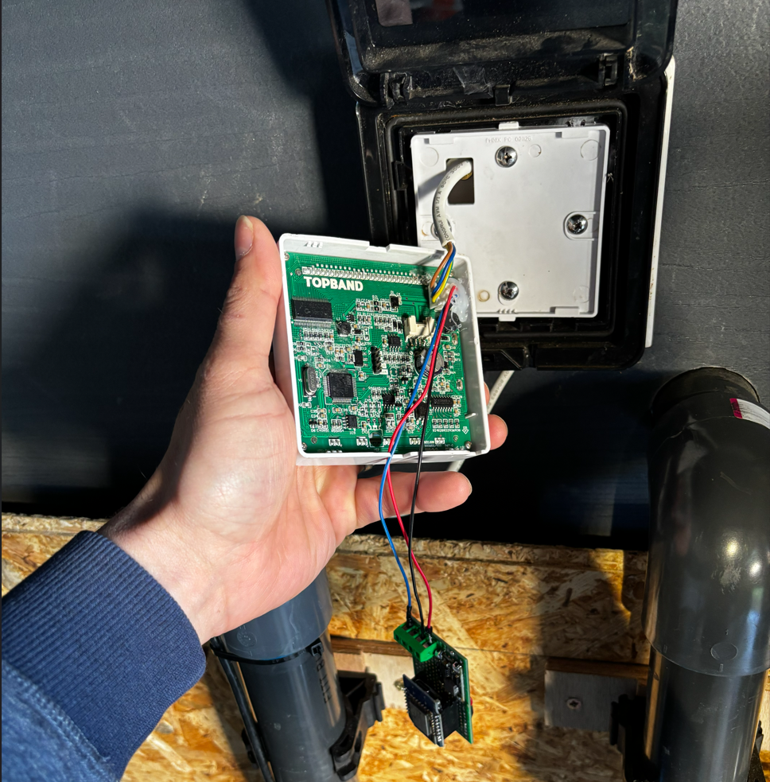
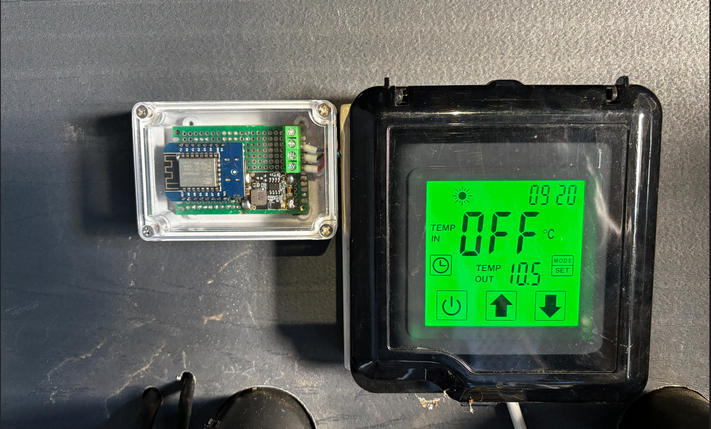

# PAC PRIMA START MONO 80 PS With PC1001 Controller

Attribution: @ed-fr

Source: [GitHub issue #11](https://github.com/sle118/hayward_pool_heater/issues/11)

Report date: 2026-04-25

Normalized by: repository maintainers, 2026-05-11

## Summary

@ed-fr reported a working Home Assistant-driven setup for a PAC PRIMA START MONO 80 PS heat pump. The technical documentation referred to a PC1005 board, but the electronics compartment cover showed a PC1001 diagram after inspection.

The setup used an ESP8266/D1 Mini-style board connected to the remote display connector `CN1` through a 12V-to-5V regulator and a bidirectional 3.3V/5V level shifter. The reported goal was to start/control the heat pump from Home Assistant based on solar production, whole-house consumption, and battery charge level.

## Hardware

| Item | Details |
| --- | --- |
| Heater model | PAC PRIMA START MONO 80 PS |
| Controller board | PC1001 observed on the compartment diagram; documentation reportedly indicated PC1005 |
| Display or connector used | `CN1` connector in the remote display |
| ESP board | ESP8266 / D1 Mini-style board |
| Power supply | 12V from `CN1` stepped down to 5V |
| Level shifter or voltage divider | Bidirectional 3.3V/5V level shifter |
| Data GPIO | D1 Mini `D5` / `GPIO14` |

## Wiring

| Heater/controller point | Intermediate hardware | ESP point | Notes |
| --- | --- | --- | --- |
| `CN1` 12V | Regulator `IN+` |  | Powers the regulator |
| `CN1` GND | Regulator GND, level shifter HV GND | D1 Mini GND | Common ground |
| `CN1` NET | Level shifter `H1` |  | Heater bus/data signal |
| Regulator 5V output | Level shifter `HV` | D1 Mini 5V | 5V rail |
| D1 Mini 3.3V | Level shifter `LV` |  | Low-voltage reference |
| Level shifter `L1` |  | D1 Mini `D5` / `GPIO14` | ESP data GPIO |
| Level shifter LV GND | Common ground | D1 Mini GND | Common low-voltage ground |

## Software

| Item | Version or detail |
| --- | --- |
| Home Assistant | 2026.4.2 |
| ESPHome | 2026.3.3 |
| Component/code source | Derived from this project, with local simplifications reported by the contributor |
| YAML/code attachments | Linked from [issue #11](https://github.com/sle118/hayward_pool_heater/issues/11) |

The contributor reported simplifying their local setup to two files under Home Assistant's ESPHome directory:

- `/homeassistant/esphome/pac_decoder.h`
- `/homeassistant/esphome/pac-piscine.yaml`

Those files are not copied here. See the source issue for the original attachments.

## What Worked

- Home Assistant-driven heat pump startup/control was reported as functional.
- The setup met the contributor's automation goal: controlling the heat pump based on solar production, whole-house consumption, and battery charge level.
- Photos and YAML/header attachments were provided in the source issue.

## Limitations And Safety Notes

- The contributor reported trouble with setpoint handling: requests around 30 C could occasionally be sent as 3 C.
- Their local solution added a guardrail to accept only setpoints between 15 C and 30 C.
- This story is a user report, not a hardware safety certification.
- Active heater control should be treated conservatively and verified on real equipment before unattended operation.

## Photos, Logs, And Attachments

The original issue includes photos of the enclosure and links to YAML/header attachments. The enclosure photos are copied into this repository so the story remains useful if the external image host removes them.

The YAML/header attachments remain linked from [issue #11](https://github.com/sle118/hayward_pool_heater/issues/11) instead of copied into the repository.

Attribution for those materials remains with @ed-fr.
